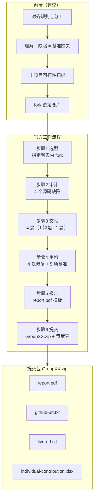
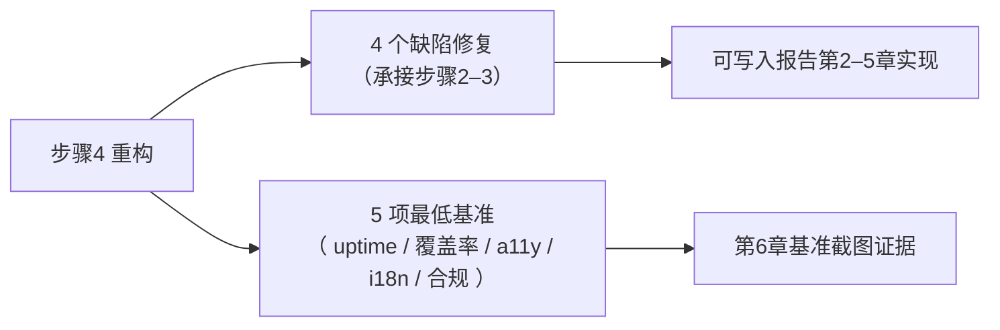
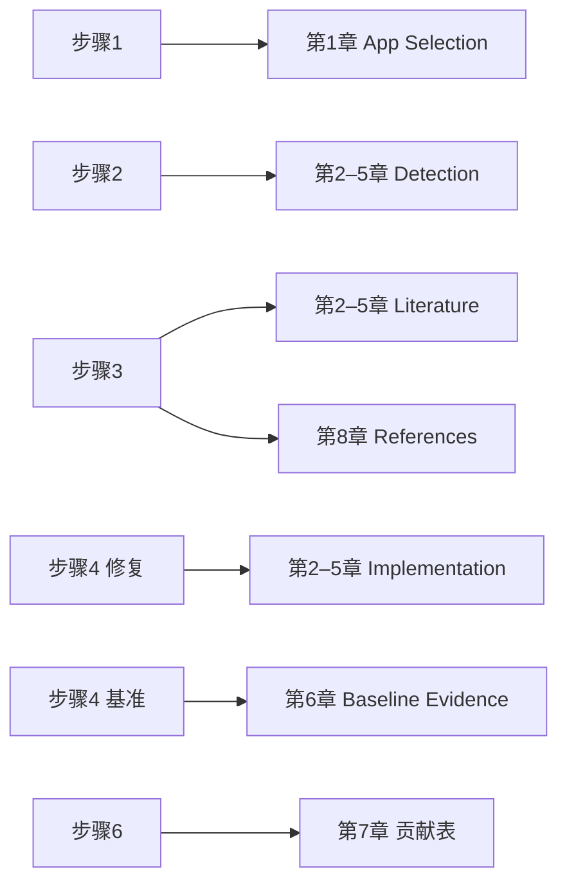

# CPT304 Coursework 1 — 完整工作流程（含可视化）

本文整理自课程作业说明（见同目录 `CPT304_Coursework_01_Details.md` 对 PDF 的结构化解析）。**若与学校发布的 PDF / Learning Mall 不一致，以官方为准。**

---

## 一、总览：从选题到提交

作业核心是按顺序完成 **6 个官方步骤**，并在重构阶段同时满足 **5 项最低基准**。此外，在正式 fork 前建议完成 **前置准备**（组内对齐、十项目可行性扫描等），以降低返工风险。

---

## 二、前置阶段（建议，非 PDF 单独编号步骤）

| 序号 | 内容 | 产出 |
|------|------|------|
| P1 | 对齐截止日、交付物、`GroupXX.zip`、Turnitin / AI 使用等规则 | 组内共识 |
| P2 | 理解「代码缺陷」≠「尚未实现的基准要求」（如 i18n、Cookie 横幅） | 避免步骤 2 审计走偏 |
| P3 | 对指定 10 个项目做可行性比较（栈、本地运行、测试与部署成本） | 选型矩阵 |
| P4 | 召开选型会，从列表中 **fork 一个**仓库 | 确定课题仓库 URL |

仓库内可参考：`docs/guides/cpt304-prerequisite-work-playbook.md`、`docs/templates/cpt304-project-selection-matrix.md`。

---

## 三、官方六步（必须顺序执行）

| 步骤 | 名称 | 要点 |
|------|------|------|
| **1** | Project Selection（项目选型） | 仅从**指定 10 个项目**中选择一个，**fork** 对应 GitHub 仓库；不得自选其他开源项目。 |
| **2** | Audit Source Code（代码审计） | 使用 axe DevTools、Lighthouse、手动检查等，识别源码中 **4 个具体、独立缺陷**；不得将步骤 4 的「缺失基准」当作这 4 个缺陷。 |
| **3** | Research（文献研究） | 为 **每个缺陷** 各检索 **1 篇**外部文献（IEEE / arXiv 论文或 dev.to / Medium 等高质量技术文），**共 4 篇、互不重复**，用于支撑修复思路。 |
| **4** | Refactor The Project（项目重构） | **双重任务**：① 按文献方案修复上述 **4 个缺陷**；② 满足 **5 项最低基准**（见下表）。 |
| **5** | Documentation（文档撰写） | 按模板撰写 **report.pdf**（总字数 1500 ±10%，代码不计入），结构含 App Selection、4 章缺陷分析、基准证据等。 |
| **6** | Assessment（评估提交） | 填写个人贡献；提交 **`GroupXX.zip`**（含 report.pdf、github-url.txt、live-url.txt、individual-contribution.xlsx）；保留 GitHub / PR 等可验证记录。 |

### 步骤 4 附：五项最低基准（Minimum Baseline Standards）

| # | 基准 | 摘要要求 |
|---|------|----------|
| B1 | Live Uptime | 在 Vercel / Render 等持续在线 **≥ 7 天** |
| B2 | Test Coverage | **≥ 80%**，Codecov / Istanbul 等可展示证据 |
| B3 | Accessibility | Lighthouse **无障碍维度 ≥ 90** |
| B4 | Internationalization | **至少两种语言**可切换 |
| B5 | Legal Compliance | **功能性 Cookie 横幅** + **独立隐私政策页面** |

---

## 四、Mermaid 可视化

### 4.1 主流程（前置 → 六步 → 交付物）

### 4.2 步骤 4 内部：两条并行要求

### 4.3 报告章节与步骤的对应关系（简图）

---

## 五、易错点（简记）

1. **步骤 2** 的缺陷必须是**已有代码问题**；**未做 i18n、无 Cookie 横幅**等属于**步骤 4 要补的基准**，不要写成「审计发现的第 1 类缺陷」。
2. **步骤 3** 不可缺少：作业强调 **Research-Led**，报告每章需要 **Detection → Literature → Implementation** 链条。
3. **步骤 4** 同时完成「修缺陷」与「五项基准」，再进入定稿报告与打包提交。

---

## 六、相关文件

| 文件 | 说明 |
|------|------|
| `CPT304_Coursework/CPT304_Coursework_01_Details.md` | PDF 全量解析稿 |
| `docs/guides/cpt304-prerequisite-work-playbook.md` | 前置工作手册 |
| `docs/templates/cpt304-project-selection-matrix.md` | 十项目选型矩阵模板 |
